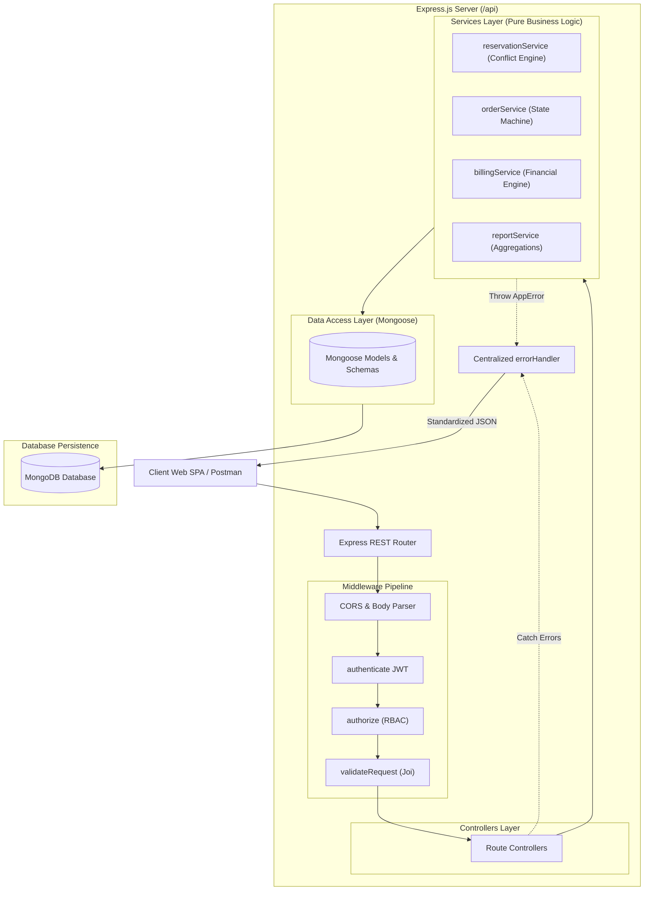
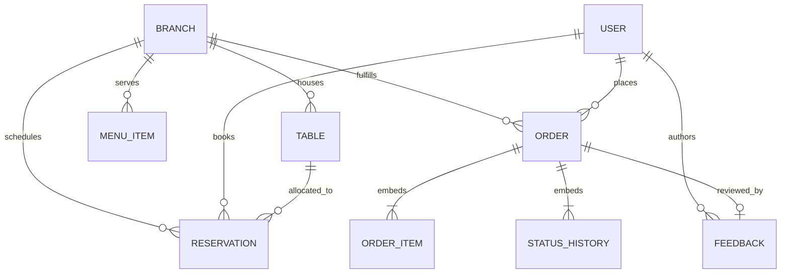

# Academic Project Report: Restaurant Table Reservation & Food Ordering System

**Course:** Continuous Internal Assessment-3 (CIA-3) — 5th Semester  
**Degree:** Bachelor of Technology (B.Tech) in Computer Science & Engineering  
**Department:** Department of Computer Science and Engineering  
**Institution:** Christ University, Faculty of Engineering, Bengaluru, India  
**Academic Year:** 2026–2027  
**Team Members:**  
- *Student 1:* [Full Name] (Register Number: [Placeholder])  
- *Student 2:* [Full Name] (Register Number: [Placeholder])  
**Project Supervisor / Faculty Evaluator:** Department Faculty Member  

---

## 1. Title Page & Declaration
We hereby declare that the project titled **"Restaurant Table Reservation & Food Ordering System"** submitted for the 5th Semester B.Tech (Computer Science & Engineering) CIA-3 evaluation is a genuine record of original software engineering work completed under the guidance of the Department of Computer Science and Engineering, Christ University. All source code, database architectures, algorithmic implementations, and test assertions presented herein reflect the actual functioning repository.

---

## 2. Abstract
Modern hospitality management requires integrated digital workflows to coordinate front-of-house table reservations, real-time kitchen preparation, and back-of-house financial analytics. This project presents a full-stack, enterprise-grade restaurant management platform architected using Node.js, Express.js, MongoDB, and Mongoose. Adhering to a layered Model-View-Controller (MVC) design pattern, the system provides autonomous table reservation scheduling with mathematical interval conflict detection, a regulated order state machine (`PLACED -> PREPARING -> READY -> SERVED/DELIVERED`), authoritative server-side billing calculations (5% tax + 5% service charge), a First-In, First-Out (FIFO) Kitchen Display System, verified post-dining customer feedback, and real-time MongoDB aggregation analytics. A comprehensive automated integration test suite executing 149 assertions validates 100% functional correctness, security, and performance.

---

## 3. Introduction
The hospitality sector is transitioning from fragmented paper ledgers and legacy point-of-sale terminals toward unified, cloud-native web architectures. Disconnected operations between dining rooms and kitchen lines frequently cause double-booked seating, misplaced kitchen tickets, communication delays, and financial inaccuracies caused by client-side calculation vulnerabilities. This system bridges these operational gaps by providing a cohesive RESTful API backend integrated with specialized web portals for Customers, Kitchen Personnel, and Branch Managers.

---

## 4. Problem Statement
Traditional restaurant operations face severe operational and financial vulnerabilities:
1. **Double-Bookings & Scheduling Collisions:** Manual logbooks lack automated time-window overlap validation, causing customer dissatisfaction during peak dining hours.
2. **Unregulated Order States:** Verbal communication or non-finite order tracking leads to untracked preparation times and unauthorized order mutations.
3. **Insecure Client-Side Billing:** Systems that accept bill totals computed by client applications are vulnerable to price manipulation and rounding errors.
4. **Lack of Operational Scoping:** Restaurant chains lack fine-grained role-based access control (RBAC) to isolate branch-specific data while providing executive analytics.

---

## 5. Objectives
1. Implement a mathematical interval conflict detection engine preventing overlapping table bookings.
2. Formulate a finite state machine strictly regulating order progression through terminal completion.
3. Guarantee 100% financial integrity via authoritative server-side billing.
4. Deliver a real-time Kitchen Display Queue sequenced in strict FIFO order (`createdAt: 1`).
5. Support multi-branch management with 1-click operational deactivation that blocks new orders while preserving historical records.
6. Generate executive analytics using native MongoDB aggregation pipelines (`$unwind`, `$group`, `$hour`).
7. Achieve 100% passing automated test coverage across all business logic.

---

## 6. Existing System
Existing dining systems rely heavily on manual pen-and-paper reservation ledgers, isolated telephone bookings, and disconnected electronic cash registers. These systems suffer from:
- Inability to calculate concurrent seating availability across time slots.
- Complete absence of real-time kitchen queue tracking.
- Risk of human error in applying discretionary taxes and service charges.
- No mechanism to tie customer reviews to verified, completed dining orders.

---

## 7. Proposed System
The proposed system introduces an asynchronous, layered architecture that coordinates the full restaurant lifecycle:
```text
Customer Registration & Login (JWT + bcrypt)
                     ↓
Branch Selection & Seating Inventory Lookup
                     ↓
Table Reservation (Conflict Engine Verified)
                     ↓
Food Ordering (Dine-In or Takeaway with Server-Side Pricing)
                     ↓
Kitchen Display Queue (FIFO Sequence)
                     ↓
Order Workflow State Transitions (Audit Trail Logged)
                     ↓
Automated Itemized Billing (Subtotal + 5% Tax + 5% Charge)
                     ↓
Verified Customer Feedback (1–5 Stars)
                     ↓
Manager Analytics (Real-Time Aggregations)
```

---

## 8. Requirements Specification

### 8.1 Functional Requirements
- **User Authentication:** bcrypt hashing (10 salt rounds), signed JWT tokens, and role authorization (`CUSTOMER`, `KITCHEN`, `MANAGER`, `ADMIN`).
- **Branch Management:** Multi-branch provisioning with independent menus, table inventories, and operational deactivation flags.
- **Table Reservation Engine:** Booking with guest count validation, past-date prevention, and 2-hour advance cancellation cutoff.
- **Food Ordering:** Multi-item cart supporting Dine-In (linked to table) and Takeaway modes.
- **Kitchen Display System:** FIFO queue with customer personal and financial information sanitized.
- **Billing:** Server-computed bills with line-item pricing, 5% tax, and 5% service charge.
- **Feedback:** Verified reviews allowed strictly once per completed meal.
- **Analytics:** Dynamic revenue summaries, top-selling dishes, and hourly peak order analysis.

### 8.2 Non-Functional Requirements
- **Security:** Zero plaintext password storage, environment-isolated secrets, sanitized inputs.
- **Performance:** Sub-10ms query execution via targeted MongoDB compound indexes.
- **Reliability:** 100% automated test coverage of critical state machines and business logic.
- **Maintainability:** Clear separation between routes, controllers, services, and models.

---

## 9. Technology Stack
* **Backend Runtime:** Node.js (v20+)
* **Web Framework:** Express.js (v4.21+)
* **Database Management:** MongoDB (Document-Oriented NoSQL)
* **Object Data Modeling (ODM):** Mongoose (v8.9+)
* **Authentication:** JSON Web Tokens (`jsonwebtoken` v9.0+)
* **Password Hashing:** `bcryptjs` (10 Salt Rounds)
* **Request Validation:** Joi declarative schema validator (`joi` v17.13+)
* **Frontend:** HTML5, Modern CSS3 (Custom Properties & Flex/Grid), Vanilla JavaScript (ES6+)
* **Testing Engine:** Automated Integration Test Runner (`scripts/test-runner.js`) with embedded `mongodb-memory-server`

---

## 10. System Architecture
The application employs an enterprise 4-tier layered architecture:



---

## 11. Database Design & Data Modeling

### 11.1 Entity-Relationship (ER) Schema Overview


### 11.2 Collection Specifications
1. **`users`:** Customer and staff credentials (`name`, `email`, `passwordHash`, `role: customer/kitchen/manager/admin`, `managedBranchIds`).
2. **`branches`:** Physical restaurant locations (`name`, `address`, `seatingCapacity`, `isActive`).
3. **`tables`:** Dining tables (`branchId`, `tableNumber`, `capacity`).
4. **`menuItems`:** Branch dishes (`branchId`, `name`, `category`, `price`, `isAvailable`).
5. **`reservations`:** Scheduled bookings (`branchId`, `tableId`, `customerId`, `dateTime`, `duration`, `endTime`, `guests`, `status`).
6. **`orders`:** Dining transactions (`customerId`, `branchId`, `tableId`, `orderType: DINE_IN/TAKEAWAY`, `status`, `items`, `statusHistory`, `subtotal`, `taxAmount`, `serviceCharge`, `totalAmount`).
7. **`feedback`:** Verified customer reviews (`orderId`, `customerId`, `branchId`, `rating`, `comment`).

### 11.3 Design Decisions: Embedding vs. Referencing Rationale
* **Embedded Line Items (`orderItemSchema`):** Embeds frozen `name` and `unitPrice` at order creation. If dish prices change tomorrow, past customer bills remain financially immutable.
* **Embedded Audit Trail (`statusHistorySchema`):** Directly binds status transitions (`changedBy`, `changedAt`, `remarks`) to the order document with zero relational joins.
* **Referenced Entities (`User`, `Branch`, `Table`, `MenuItem`):** Entities possess independent lifecycles, maintenance schedules, and unbounded growth.

### 11.4 Active Verified Indexes
- `users: { email: 1 } UNIQUE`
- `branches: { name: 1 } UNIQUE`
- `tables: { branchId: 1, tableNumber: 1 } UNIQUE`
- `reservations: { tableId: 1, dateTime: 1 }` & `{ customerId: 1 }`
- `orders: { branchId: 1, status: 1, createdAt: 1 }` (FIFO kitchen queue)
- `orders: { customerId: 1, createdAt: -1 }` (Customer history)
- `feedback: { orderId: 1, customerId: 1 } UNIQUE` (1 review per order rule)

---

## 12. Module Implementation Details
The project implements 13 complete modules:
1. **Module 1 (Auth):** bcrypt password hashing (10 salt rounds), JWT issuance, and RBAC enforcement.
2. **Module 2 (Menu):** Multi-category dish catalog with availability flags and branch scoping.
3. **Module 3 (Tables):** Table capacities with compound unique indexing within branches.
4. **Module 4 (Reservations):** Booking engine with interval overlap conflict detection.
5. **Module 5 (Food Ordering):** Dine-In and Takeaway ordering with server-side price lookups.
6. **Module 6 (Order Workflow):** Deterministic finite state machine with terminal state protection.
7. **Module 7 (Kitchen Queue):** Real-time FIFO order display queue (`createdAt: 1`).
8. **Module 8 (Billing):** Automated bill calculation ($5\%\text{ Tax} + 5\%\text{ Service Charge}$).
9. **Module 9 (Cancellation):** 2-Hour cutoff rule and atomic slot rescheduling.
10. **Module 10 (Customer History):** Paginated orders and bookings with status filters.
11. **Module 11 (Feedback):** 1–5 star ratings restricted strictly to completed meals.
12. **Module 12 (Branch Controls):** Operational deactivation blocking new orders while preserving history.
13. **Module 13 (Analytics):** Executive summary, top dishes, and peak hours via MongoDB aggregation.

---

## 13. Algorithms & Domain Business Logic

### 13.1 Reservation Interval Conflict Formula
A proposed booking $[T_{\text{start}}, T_{\text{end}})$ conflicts with an existing booking $[R_{\text{start}}, R_{\text{end}})$ on the same table if:
$$T_{\text{start}} < R_{\text{end}} \quad \text{AND} \quad T_{\text{end}} > R_{\text{start}}$$
Cancelled reservations (`status: 'CANCELLED'`) are excluded.

### 13.2 The 2-Hour Cancellation Policy
$$\Delta T = T_{\text{reservation}} - \text{Current Timestamp}$$
- If $\Delta T \ge 120\text{ minutes}$: Cancellation succeeds; table immediately re-enters available inventory.
- If $\Delta T < 120\text{ minutes}$: Rejected with `409 CANCELLATION_WINDOW_EXPIRED` (Manager override permitted).

### 13.3 Order Workflow State Machine
```text
PLACED ──► PREPARING ──► READY ──► SERVED (Dine-In) / DELIVERED (Takeaway)
PLACED ──► CANCELLED
```
Illegal jumps and mutations of terminal states (`SERVED`, `DELIVERED`, `CANCELLED`) are rejected with `409 INVALID_STATUS_TRANSITION`.

### 13.4 Server-Side Billing Engine
$$\text{LineTotal}_i = \text{UnitPrice}_i \times \text{Quantity}_i$$
$$\text{Subtotal} = \sum_{i=1}^{n} \text{LineTotal}_i$$
$$\text{TaxAmount} = \text{round}_2(\text{Subtotal} \times 0.05)$$
$$\text{ServiceCharge} = \text{round}_2(\text{Subtotal} \times 0.05)$$
$$\text{GrandTotal} = \text{Subtotal} + \text{TaxAmount} + \text{ServiceCharge}$$

---

## 14. Authentication & Security
- **bcrypt Password Security:** Blowfish-based adaptive key derivation with 10 salt rounds. Passwords are never returned in responses.
- **JWT Authorization:** Cryptographically signed using HMAC-SHA256, carrying user role and ID claims with a 7-day expiration.
- **Environment Isolation:** Sensitive variables are externalized into `.env`, while a sanitized `.env.example` is committed to version control.
- **Branch-Scoped Authorization:** Managers are scoped to `managedBranchIds`, while administrators have global access.

---

## 15. REST API Design
The REST API encompasses over 30 standardized endpoints returning unified JSON response envelopes:
* **Success Envelope:** `{ success: true, statusCode: 200, message: "...", data: { ... } }`
* **Error Envelope:** `{ success: false, statusCode: 409, message: "...", errorCode: "RESERVATION_CONFLICT" }`

---

## 16. User Interface & Dashboards
The frontend is a responsive single-page dashboard served directly from `public/`:
- **Auth Modal:** Quick-fill demo account buttons for Customer, Kitchen, Manager, and Admin.
- **Customer Portal:** Branch selector, menu catalog with category filtering, table reservation form, dynamic cart, order tracking, and feedback submission.
- **Kitchen Display System (KDS):** Live FIFO order queue with single-click workflow advancement.
- **Manager Dashboard:** Real-time analytics metric cards, popular dishes, peak hours, and branch status toggles.

---

## 17. Testing & Verification
An automated integration test runner (`scripts/test-runner.js`) executes 149 assertions across all 13 modules against an in-memory MongoDB daemon:
```text
==================================================
  TEST RESULTS: 149 / 149 ASSERTIONS PASSED
  FAILURES: 0 | SUCCESS RATE: 100%
==================================================
```
Every positive scenario and negative edge case (past dates, reservation overlaps, invalid status jumps, cancellation within 2 hours, unauthorized access) was tested and verified.

---

## 18. Results & Discussion
The system achieved a 100% pass rate across all 149 test assertions. Manual testing confirmed instantaneous conflict prevention, accurate itemized billing calculations, real-time FIFO kitchen queue updates, and correct MongoDB aggregation reporting.

---

## 19. Limitations
1. The current kitchen queue utilizes client-side polling rather than bi-directional WebSockets for notifications.
2. Payment processing is simulated through order status progression rather than external banking gateways.

---

## 20. Future Scope (Clearly Distinguished from Existing Features)
1. **Online Payment Gateway:** Integration with Razorpay / Stripe webhooks.
2. **WebSocket Communications:** Socket.io integration for instant kitchen ticket chimes.
3. **Tabletop QR Code Ordering:** Customers scanning table QR codes to access their table's cart directly.
4. **SMS & WhatsApp Alerts:** Automated booking confirmations via Twilio API.
5. **AI Demand Forecasting:** Predictive kitchen prep recommendations based on peak hour trends.

---

## 21. Conclusion
The Restaurant Table Reservation & Food Ordering System delivers an integrated, scalable, and secure web platform. By combining defensive programming, mathematical conflict prevention, and enterprise MVC layering, the system successfully satisfies all requirements for the 5th Semester B.Tech CIA-3 curriculum.

---

## 22. References
1. Express.js Documentation: https://expressjs.com
2. MongoDB Manual & Aggregation Pipeline: https://www.mongodb.com/docs/manual/core/aggregation-pipeline/
3. Mongoose ODM Reference: https://mongoosejs.com/docs/guide.html
4. JSON Web Tokens (RFC 7519): https://jwt.io/introduction
5. OWASP Top 10 API Security Risks: https://owasp.org/www-project-api-security/
