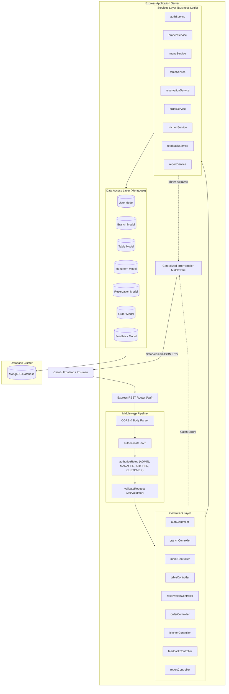
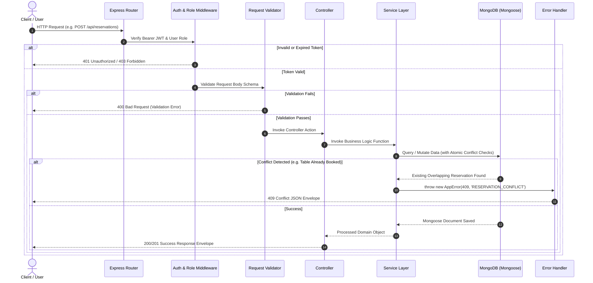

# System Architecture & Technical Design

**Project:** Restaurant Table Reservation & Food Ordering System  
**Course:** 5th Semester B.Tech (Computer Science & Engineering) — CIA-3  
**Technology Stack:** Node.js, Express.js, MongoDB, Mongoose, JWT, bcrypt  

---

## 1. Architectural Overview

The application is architected following the **Model-View-Controller (MVC) / Layered Service-Oriented Pattern**. This decouples business logic from HTTP transport protocols, ensuring maintainability, testability, and enterprise-grade code hygiene.



---

## 2. Request-Response Execution Lifecycle

Every incoming HTTP request travels through a deterministic sequential pipeline:



---

## 3. Layer Separation Rationale

### 3.1 Routes (`routes/`)
- Pure routing declarations.
- Maps HTTP verbs and URI paths to corresponding middleware and controller methods.
- Contains zero business logic or database queries.

### 3.2 Middleware (`middleware/`)
- **`authMiddleware.js`**: Decodes and verifies the Bearer JWT token, fetching active user credentials and attaching `req.user`.
- **`roleMiddleware.js`**: Enforces Role-Based Access Control (RBAC) across `CUSTOMER`, `KITCHEN`, `MANAGER`, and `ADMIN`.
- **`validator.js`**: Performs schema validation on `req.body`, `req.query`, and `req.params`.
- **`errorHandler.js`**: Catches all synchronous and asynchronous errors, formats consistent error responses, and prevents sensitive stack traces from leaking to clients.

### 3.3 Controllers (`controllers/`)
- HTTP transport coordinators.
- Extracts parameters from `req.body`, `req.params`, and `req.query`.
- Passes sanitized data to the service layer.
- Returns standardized responses via `successResponse(res, statusCode, message, data)`.

### 3.4 Services (`services/`)
- Pure, reusable domain business logic.
- Independent of Express HTTP requests/responses (can be invoked by test runners, cron tasks, or CLI scripts).
- Handles complex transactions, time-window conflict calculations, state transitions, subtotal/tax computations, and MongoDB aggregations.
- Throws typed `AppError` instances with explicit HTTP status codes and machine-readable error codes.

### 3.5 Models (`models/`)
- Mongoose schemas defining database structures, types, validations, default values, and compound indexes.
- Strips sensitive fields (`password`, `__v`) and transforms `_id` into string `id` upon serialization.

---

## 4. Centralized Error Handling Strategy

The application avoids scattered `try/catch` error formatting by implementing a centralized error handler:

1. **`AppError`**: Custom error class extending JavaScript's `Error`:
   ```javascript
   class AppError extends Error {
     constructor(message, statusCode, errorCode = null) {
       super(message);
       this.statusCode = statusCode;
       this.errorCode = errorCode;
       this.isOperational = true;
       Error.captureStackTrace(this, this.constructor);
     }
   }
   ```
2. **Standardized Error Envelope**:
   ```json
   {
     "success": false,
     "message": "Table 2 is already reserved for the requested time slot",
     "errorCode": "RESERVATION_CONFLICT"
   }
   ```
3. **Mongoose Error Translation**: Centralized middleware automatically intercepts:
   - Duplicate key errors (`E11000`) -> Translated to `409 Conflict`
   - Cast errors (invalid ObjectIds) -> Translated to `400 Bad Request`
   - Schema validation errors -> Translated to `400 Bad Request`
