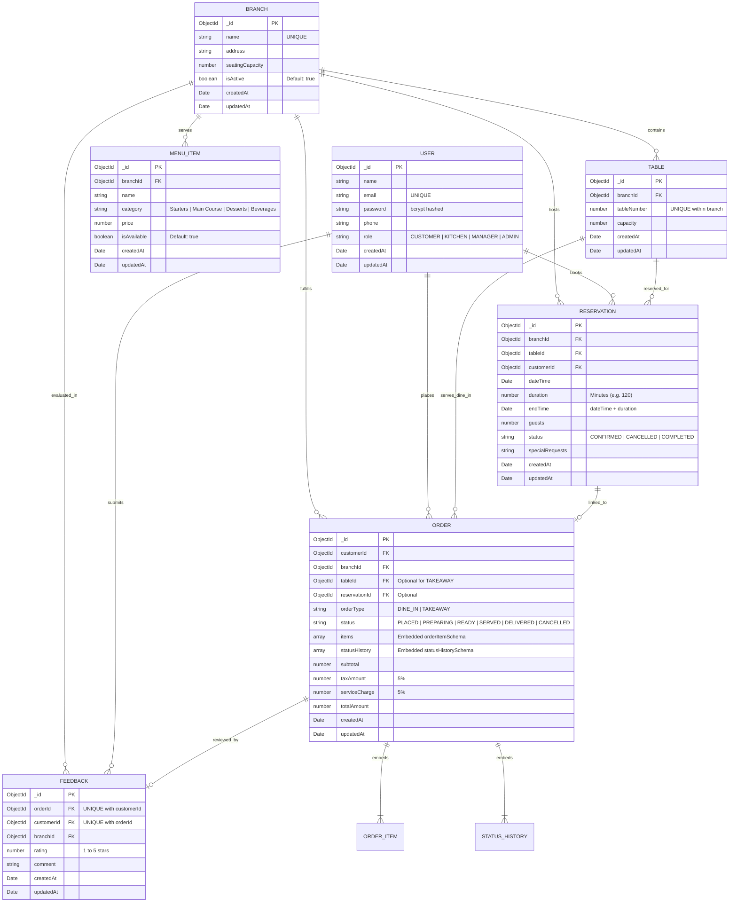

# Database Design & Data Modeling

**Database Engine:** MongoDB (Document-Oriented NoSQL)  
**Object Data Modeling (ODM):** Mongoose v8  
**Architecture:** Hybrid Schema (Referenced Entities with Embedded Snapshots)

---

## 1. Entity-Relationship (ER) Diagram

---

## 2. Collection Schemas in Detail

### 2.1 `users`
Represents system actors (Customers, Kitchen Staff, Branch Managers, System Administrators).
* **Fields:**
  - `name` (String, required, trimmed, minlength: 2, maxlength: 100)
  - `email` (String, required, unique, lowercase, trimmed, validated via regex)
  - `password` (String, required, minlength: 6, hashed with bcrypt at 10 salt rounds, excluded from JSON/Object serialization)
  - `phone` (String, optional, trimmed)
  - `role` (String, enum: `CUSTOMER`, `KITCHEN`, `MANAGER`, `ADMIN`, default: `CUSTOMER`)
* **Indexes:**
  - `{ email: 1 }` (Unique)

### 2.2 `branches`
Represents distinct physical restaurant locations.
* **Fields:**
  - `name` (String, required, unique, trimmed, minlength: 3, maxlength: 100)
  - `address` (String, required, trimmed, minlength: 5)
  - `seatingCapacity` (Number, required, min: 1)
  - `isActive` (Boolean, default: true)
* **Indexes:**
  - `{ name: 1 }` (Unique)

### 2.3 `tables`
Represents dining tables partitioned by branch.
* **Fields:**
  - `branchId` (ObjectId, ref: `Branch`, required)
  - `tableNumber` (Number, required, min: 1)
  - `capacity` (Number, required, min: 1)
* **Indexes:**
  - `{ branchId: 1, tableNumber: 1 }` (Unique compound index preventing duplicate table numbers within the same branch)
  - `{ branchId: 1 }` (Branch lookup)

### 2.4 `menuItems`
Represents individual food and beverage items tied to a branch.
* **Fields:**
  - `branchId` (ObjectId, ref: `Branch`, required)
  - `name` (String, required, trimmed, minlength: 2, maxlength: 100)
  - `category` (String, required, enum: `Starters`, `Main Course`, `Desserts`, `Beverages`, trimmed)
  - `price` (Number, required, min: 0.01)
  - `isAvailable` (Boolean, default: true)
* **Indexes:**
  - `{ branchId: 1 }` (Branch menu lookup)
  - `{ branchId: 1, category: 1 }` (Category filtering)

### 2.5 `reservations`
Represents scheduled table bookings by customers.
* **Fields:**
  - `branchId` (ObjectId, ref: `Branch`, required)
  - `tableId` (ObjectId, ref: `Table`, required)
  - `customerId` (ObjectId, ref: `User`, required)
  - `dateTime` (Date, required)
  - `duration` (Number, required, min: 30, max: 360, default: 120 minutes)
  - `endTime` (Date, pre-computed via Mongoose hook: `dateTime + duration * 60000`)
  - `guests` (Number, required, min: 1)
  - `status` (String, enum: `CONFIRMED`, `CANCELLED`, `COMPLETED`, default: `CONFIRMED`)
  - `specialRequests` (String, optional, maxlength: 500)
* **Indexes:**
  - `{ customerId: 1 }` (Customer reservation history)
  - `{ tableId: 1, dateTime: 1 }` (Time-overlap conflict lookup)
  - `{ customerId: 1, dateTime: -1 }` (Chronological customer history)
  - `{ branchId: 1, dateTime: 1 }` (Branch booking lookup)
  - `{ status: 1 }` (Status filtering)

### 2.6 `orders`
Represents food orders with embedded line items and immutable status audit trails.
* **Fields:**
  - `customerId` (ObjectId, ref: `User`, required)
  - `branchId` (ObjectId, ref: `Branch`, required)
  - `tableId` (ObjectId, ref: `Table`, optional for `TAKEAWAY`)
  - `reservationId` (ObjectId, ref: `Reservation`, optional)
  - `orderType` (String, enum: `DINE_IN`, `TAKEAWAY`, required)
  - `status` (String, enum: `PLACED`, `PREPARING`, `READY`, `SERVED`, `DELIVERED`, `CANCELLED`, default: `PLACED`)
  - `items` (Array of embedded `orderItemSchema`, min 1 item required):
    - `menuItemId` (ObjectId, ref: `MenuItem`, required)
    - `name` (String, frozen snapshot at time of order)
    - `unitPrice` (Number, frozen snapshot at time of order)
    - `quantity` (Number, required, min: 1, max: 50)
    - `lineTotal` (Number, calculated: `unitPrice * quantity`)
  - `statusHistory` (Array of embedded `statusHistorySchema`):
    - `status` (String, required)
    - `changedBy` (ObjectId, ref: `User`)
    - `changedAt` (Date, default: `Date.now`)
    - `remarks` (String)
  - `subtotal` (Number, calculated: sum of item `lineTotal`s)
  - `taxAmount` (Number, 5% of subtotal)
  - `serviceCharge` (Number, 5% of subtotal)
  - `totalAmount` (Number, `subtotal + taxAmount + serviceCharge`)
* **Indexes:**
  - `{ customerId: 1, createdAt: -1 }` (Customer order history sorting)
  - `{ branchId: 1, status: 1, createdAt: 1 }` (Kitchen display FIFO queue optimization)
  - `{ reservationId: 1 }` (Reservation order linking)
  - `{ status: 1 }` (Status querying)

### 2.7 `feedback`
Represents post-dining customer ratings and comments.
* **Fields:**
  - `orderId` (ObjectId, ref: `Order`, required)
  - `customerId` (ObjectId, ref: `User`, required)
  - `branchId` (ObjectId, ref: `Branch`, required)
  - `rating` (Number, required, integer between 1 and 5)
  - `comment` (String, optional, maxlength: 500)
* **Indexes:**
  - `{ orderId: 1, customerId: 1 }` (Unique compound index ensuring strictly one feedback per completed order per customer)
  - `{ branchId: 1, createdAt: -1 }` (Branch ratings report)
  - `{ customerId: 1, createdAt: -1 }` (Customer feedback history)

---

## 3. Design Decisions: Embedding vs. Referencing Rationale

| Data Structure | Design Pattern | Justification & Viva Explanation |
| :--- | :--- | :--- |
| **Order Items** | **Embedded** | **Historical Integrity & Auditability:** If a restaurant changes dish prices or renames a menu item tomorrow, past customer bills must NOT retroactively change. Embedding line items with frozen `name` and `unitPrice` ensures 100% financial and audit consistency. |
| **Status History** | **Embedded** | **Atomic State Transitions:** The audit log of who changed order status and when is bound directly to the lifecycle of the order document. Embedding guarantees zero-join reads for kitchen and manager tracking. |
| **Menu Items** | **Referenced** | **Single Source of Truth:** Menu items are updated independently by managers (toggling availability, updating descriptions) and are queried collectively per branch. |
| **Users / Customers** | **Referenced** | **Decoupled Identity:** Users exist independently of orders and reservations. Storing `customerId` enables cross-system references without bloating transaction records. |
| **Branches & Tables** | **Referenced** | **Hierarchical Inventory:** Physical restaurant spaces and seating assets have their own lifecycles, capacities, and maintenance schedules separate from individual customer transactions. |

---

## 4. Indexing & Query Optimization Matrix

| Collection | Index Keys | Type | Optimized Operation |
| :--- | :--- | :--- | :--- |
| `users` | `{ email: 1 }` | Unique | Fast authentication lookup & duplicate email prevention |
| `branches` | `{ name: 1 }` | Unique | Duplicate branch name prevention |
| `tables` | `{ branchId: 1, tableNumber: 1 }` | Compound Unique | Prevents duplicate table numbers within a branch |
| `tables` | `{ branchId: 1 }` | Single Field | Retrieves all tables for a branch |
| `menuItems` | `{ branchId: 1 }` | Single Field | Retrieves entire branch menu |
| `reservations` | `{ customerId: 1 }` | Single Field | Customer reservation lookup |
| `reservations` | `{ tableId: 1, dateTime: 1 }` | Compound | Fast overlap conflict detection during booking |
| `orders` | `{ customerId: 1, createdAt: -1 }` | Compound | Chronologically sorted customer order history |
| `orders` | `{ branchId: 1, status: 1, createdAt: 1 }` | Compound | **FIFO Kitchen Queue:** Orders pending preparation sorted oldest first |
| `feedback` | `{ orderId: 1, customerId: 1 }` | Compound Unique | **One Feedback Policy:** Rejects duplicate reviews on the same order |
